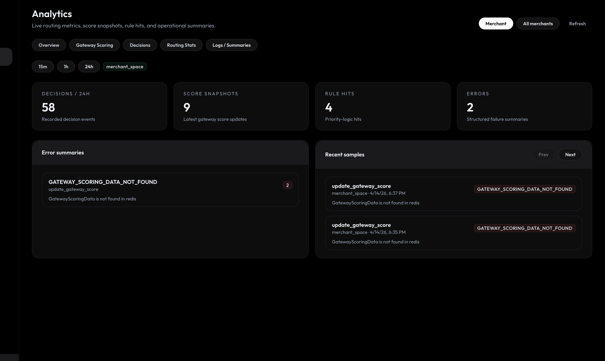

# Decision Engine

<div align="center">

<picture>
  <source media="(prefers-color-scheme: dark)" srcset="docs/logo/decision-engine-dark.svg">
  
</picture>

<br />
<br />


<br />
<br />

Merchant-facing routing control plane for deciding gateways, updating score models, exposing connector analytics, and tracing payment-level audit flows from one product.

<br />
<br />

<a href="docs/local-setup.md"><strong>Quick Start</strong></a>
·
<a href="docs/dashboard.mdx"><strong>Dashboard</strong></a>
·
<a href="docs/analytics.mdx"><strong>Analytics</strong></a>
·
<a href="docs/payment-audit.mdx"><strong>Payment Audit</strong></a>
·
<a href="docs/api-reference.md"><strong>API Reference</strong></a>

</div>

<br />



## Table of Contents

- [What You Can Do](#what-you-can-do)
- [Quickstart](#quickstart)
- [Dashboard Surfaces](#dashboard-surfaces)
- [Docs Map](#docs-map)
- [Development](#development)
- [License](#license)

## What You Can Do

- **Route with live score context**
  Use `POST /decide-gateway` and `POST /update-gateway-score` to choose connectors and continuously feed transaction outcomes back into the scoring model.
- **Mix static and dynamic routing**
  Combine `priority`, `single`, `volume_split`, and `advanced` rule-based routing under `/routing/*`, while keeping `/rule/*` for runtime routing configuration.
- **Operate from a real dashboard**
  The React dashboard ships with routing views, analytics, connector score trends, and payment audit timelines instead of forcing operators into Redis, SQL, or raw logs.
- **Explain why a payment routed where it did**
  Payment Audit links decision responses, rule hits, score updates, and connector score context so teams can answer why a connector was selected at that point in time.

## Quickstart

```bash
git clone https://github.com/juspay/decision-engine.git
cd decision-engine
docker compose --profile postgres-ghcr up -d
curl http://localhost:8080/health
```

Expected response:

```json
{"message":"Health is good"}
```

For the full local setup matrix, source runs, dashboard profiles, and Helm flows, use [docs/local-setup.md](docs/local-setup.md).

## Dashboard Surfaces

| Surface | Why you open it | Primary doc |
| --- | --- | --- |
| `Analytics` | live connector metrics, score snapshots, rule hits, and routing summaries | [docs/analytics.mdx](docs/analytics.mdx) |
| `Payment Audit` | payment-by-payment request, response, score context, and timeline inspection | [docs/payment-audit.mdx](docs/payment-audit.mdx) |
| `Routing Hub` | configure rule-based routing, SR-based routing, volume splits, and debit routing | [docs/dashboard.mdx](docs/dashboard.mdx) |
| `API Reference` | OpenAPI-backed endpoint pages and curl examples | [docs/api-reference.md](docs/api-reference.md) |

## Docs Map

- [Introduction](docs/introduction.mdx)
- [Local Setup](docs/local-setup.md)
- [Configuration](docs/configuration.md)
- [Dashboard](docs/dashboard.mdx)
- [Analytics](docs/analytics.mdx)
- [Payment Audit](docs/payment-audit.mdx)
- [API Reference](docs/api-reference.md)
- [API Examples](docs/api-reference1.md)
- [OpenAPI Source](docs/openapi.json)
- [PostgreSQL Setup](docs/setup-guide-postgres.md)
- [MySQL Setup](docs/setup-guide-mysql.md)

## Development

```bash
# lint
just clippy

# compile matrix
just check

# tests
cargo test

# postgres migrations
just migrate-pg
```

The repo also ships a one-command local startup path in [oneclick.sh](oneclick.sh), which brings up the API, dashboard, and docs preview together.

## License

Licensed under [GNU AGPL v3.0](LICENSE).
