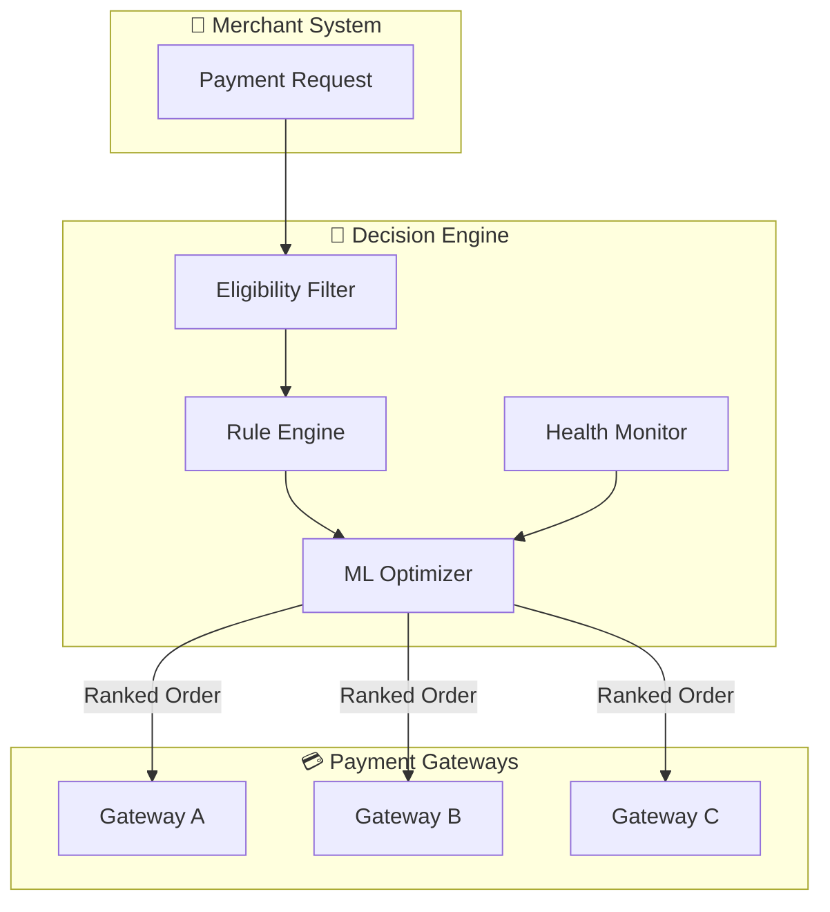

<div align="center">

# 🧠 Decision Engine

**Intelligent Payment Routing for the Modern Fintech Stack**

*A blazingly fast, ML-powered payment gateway orchestrator that maximizes transaction success rates in real-time.*

[](https://www.rust-lang.org/)
[](LICENSE)
[](Dockerfile)
[](helm-charts)
[](https://github.com/juspay/decision-engine/discussions)

[🚀 Quick Start](#-quick-start) • [✨ Features](#-features) • [📖 Documentation](#-documentation) • [🤝 Contributing](#-contributing)

</div>

---

## 🎯 Why Decision Engine?

Every payment transaction is an opportunity. The Decision Engine ensures you never miss one.

| Problem | Solution |
|---------|----------|
| 💸 **Failed transactions cost revenue** | Smart routing to highest-success gateways |
| ⏱️ **Latency kills conversions** | Real-time gateway performance optimization |
| 🔧 **Complex integrations** | Modular design works with any orchestrator |
| 📊 **Blind to gateway issues** | Proactive downtime detection & rerouting |

---

## ✨ Features

### 🎯 Core Capabilities

<table>
<tr>
<td width="50%">

### ✅ Eligibility Check
Automatically filters gateways based on transaction parameters—card type, currency, region, amount—ensuring only eligible processors are considered.

</td>
<td width="50%">

### 📌 Rule-Based Ordering
Define merchant-specific routing rules for predictable, obligation-driven payment processing. Perfect for contractual commitments.

</td>
</tr>
<tr>
<td width="50%">

### 🔄 Dynamic Gateway Ordering
ML-driven optimization using real-time success rates and latency metrics. Adapts to changing gateway performance automatically.

</td>
<td width="50%">

### ⚠️ Downtime Detection
Continuous gateway health monitoring with automatic failover. Prevents transaction failures before they happen.

</td>
</tr>
</table>

### 🔥 Tech Highlights

- ⚡ **Blazing Fast** — Built in Rust with sub-millisecond routing decisions
- 🔒 **Vault Agnostic** — Works with any PCI-compliant card vault
- 🔌 **Orchestrator Independent** — Plug into your existing payment stack
- 🐳 **Cloud Native** — Docker + Kubernetes ready with Helm charts
- 🗄️ **Database Flexible** — MySQL or PostgreSQL, your choice

---

## 🏗️ Architecture

<div align="center">



</div>

### How It Fits Your Stack

The Decision Engine sits between your payment orchestrator and payment gateways:

```
┌─────────────────┐     ┌──────────────────┐     ┌──────────────────┐
│   Your App      │────▶│  Orchestrator    │────▶│  Decision Engine │
└─────────────────┘     └──────────────────┘     └────────┬─────────┘
                                                          │
                        ┌─────────────────────────────────┼─────────────────────────────────┐
                        │                                 │                                 │
                        ▼                                 ▼                                 ▼
                 ┌─────────────┐                  ┌─────────────┐                  ┌─────────────┐
                 │  Gateway A  │                  │  Gateway B  │                  │  Gateway C  │
                 └─────────────┘                  └─────────────┘                  └─────────────┘
```

---

## 🚀 Quick Start

### Prerequisites

- Rust 1.85+ (or Docker)
- PostgreSQL 15+ or MySQL 8+
- Redis 7+ (optional, for caching)

### Option 1: Docker (Recommended)

```bash
# Clone the repository
git clone https://github.com/juspay/decision-engine.git
cd decision-engine

# Start with Docker Compose (includes PostgreSQL + Redis)
docker-compose up -d

# The API is now available at http://localhost:3001
```

### Option 2: Cargo

```bash
# Clone and build
git clone https://github.com/juspay/decision-engine.git
cd decision-engine

# Copy example config
cp config.example.toml config.toml

# Edit config with your database credentials
# Then run migrations and start
cargo run --release
```

### Option 3: Kubernetes (Helm)

```bash
# Add the Helm chart (if published) or use local charts
helm install decision-engine ./helm-charts/decision-engine \
  --set database.host=your-postgres-host \
  --set database.name=open_router
```

<details>
<summary>📋 Detailed Setup Guide</summary>

For step-by-step setup instructions with database configuration:

- **PostgreSQL**: See [setup-guide-postgres.md](docs/setup-guide-postgres.md)
- **MySQL**: See [setup-guide-mysql.md](docs/setup-guide-mysql.md)
- **Configuration**: See [configuration.md](docs/configuration.md)

</details>

---

## 📖 Usage Examples

### Get Routing Decision

```bash
# Request optimal gateway ordering for a transaction
curl -X POST http://localhost:3001/route \
  -H "Content-Type: application/json" \
  -d '{
    "merchant_id": "merchant_123",
    "amount": 1000,
    "currency": "USD",
    "card_network": "visa",
    "payment_method": "card"
  }'
```

**Response:**
```json
{
  "gateways": [
    {"gateway_id": "stripe", "priority": 1, "score": 0.98},
    {"gateway_id": "adyen", "priority": 2, "score": 0.92},
    {"gateway_id": "paypal", "priority": 3, "score": 0.85}
  ]
}
```

### Configure Routing Rules

```bash
# Set merchant-specific routing rules
curl -X PUT http://localhost:3001/config/merchant_123/rules \
  -H "Content-Type: application/json" \
  -d '{
    "rules": [
      {"gateway": "stripe", "priority": 1, "conditions": {"currency": "USD"}},
      {"gateway": "adyen", "priority": 1, "conditions": {"currency": "EUR"}}
    ]
  }'
```

<details>
<summary>📚 Full API Reference</summary>

Complete API documentation is available in [API_REFERENCE.md](docs/api-reference.md).

Key endpoints:

| Endpoint | Method | Description |
|----------|--------|-------------|
| `/route` | POST | Get gateway routing decision |
| `/config/{merchant_id}/rules` | PUT | Update routing rules |
| `/health` | GET | Gateway health status |
| `/metrics` | GET | Prometheus metrics |

</details>

---

## 📊 Roadmap

| Status | Feature | Description |
|:------:|---------|-------------|
| ✅ | Rule-Based Routing | Static priority rules per merchant |
| ✅ | Success Rate Optimization | ML-driven gateway ordering |
| ✅ | Downtime Detection | Automatic gateway health monitoring |
| ✅ | Multi-Database Support | PostgreSQL & MySQL backends |
| 🚧 | A/B Testing Framework | Experiment with routing strategies |
| 🚧 | Custom ML Models | Bring your own ranking model |
| 📋 | Admin Dashboard | Web UI for configuration |
| 📋 | Analytics Pipeline | Transaction success analytics |

---

## 🤝 Contributing

We welcome contributions from everyone! 

<table>
<tr>
<td width="50%" align="center">

**🛠️ Code Contributions**

See [CONTRIBUTING.md](CONTRIBUTING.md) for guidelines.

</td>
<td width="50%" align="center">

**💬 Ideas & Discussions**

Join our [GitHub Discussions](https://github.com/juspay/decision-engine/discussions).

</td>
</tr>
</table>

### Development Setup

```bash
# Run tests
cargo test

# Run with hot reload (requires cargo-watch)
cargo watch -x run

# Check code style
cargo clippy -- -D warnings

# Format code
cargo fmt
```

---

## 💬 Support & Community

| Channel | Best For |
|---------|----------|
| [](https://join.slack.com/t/hyperswitch-io/shared_invite/zt-2jqxmpsbm-WXUENx022HjNEy~Ark7Orw) | Real-time help, discussions |
| [](https://github.com/juspay/decision-engine/discussions) | Feature requests, roadmap |
| [](https://github.com/juspay/decision-engine/issues/new/choose) | Bug reports |

---

## 📝 License

This project is licensed under the **AGPL v3 License** — see [LICENSE](LICENSE) for details.

---

## 🙏 Acknowledgments

- Built with ❤️ by [Juspay](https://juspay.io)
- Inspired by the need for open, interoperable payment infrastructure
- See [CHANGELOG.md](CHANGELOG.md) for version history

---

<div align="center">

**[⬆ Back to Top](#-decision-engine)**

*Star ⭐ this repo if you find it useful!*

</div>
