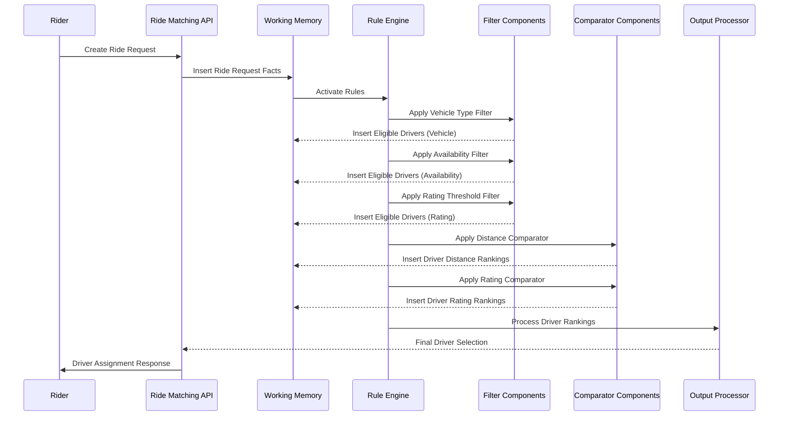

# Extending the Unified Routing Framework for Cab Services

This document outlines how the existing unified routing framework can be extended to support other domains such as cab services, maintaining the same architectural principles while adapting to domain-specific requirements.

## Conceptual Mapping

The core components of our unified framework map well to cab service domain needs:

| Framework Component | Payment Processing | Cab Service Equivalent |
|---------------------|--------------------|-----------------------|
| Entities | Gateways, Merchants, Transactions | Drivers, Cabs, Riders, Rides |
| Filters | Gateway eligibility filters | Driver/cab availability filters |
| Comparators | Success rate, latency ranking | Distance, rating, ETA ranking |
| Output Processors | Priority lists, volume splits | Driver assignment strategies |
| Working Memory | Transaction contexts, gateway metrics | Ride requests, driver metrics |

## Domain Entities

```java
// Core entities for cab service domain
fact Rider {
    String riderId;
    String name;
    GeoLocation currentLocation;
    RiderPreferences preferences;
    RiderMetrics metrics;  // ride history, ratings given, etc.
}

fact Driver {
    String driverId;
    String name;
    GeoLocation currentLocation;
    DriverStatus status;  // available, busy, offline
    VehicleType vehicleType;
    double rating;
    DriverMetrics metrics; // acceptance rate, cancellation rate, etc.
}

fact Vehicle {
    String vehicleId;
    String driverId;
    VehicleType type;  // sedan, suv, luxury, bike, etc.
    String model;
    int capacity;
    VehicleFeatures features;  // AC, child seat, etc.
}

fact RideRequest {
    String requestId;
    String riderId;
    GeoLocation pickupLocation;
    GeoLocation dropLocation;
    timestamp requestTime;
    VehicleType requestedVehicleType;
    int passengers;
    List<String> specialRequests;  // wheelchair access, etc.
    PaymentMethod paymentMethod;
    RideType rideType;  // standard, scheduled, shared
}
```

## Filter Components

Just as gateway filters eliminate incompatible payment gateways, cab service filters eliminate drivers that don't meet basic criteria for a ride request:

```json
{
  "id": "vehicle_type_filter",
  "type": "filter",
  "implementation": "VehicleTypeFilter",
  "config": {
    "vehicle_type_mapping": {
      "standard": ["sedan", "hatchback"],
      "premium": ["suv", "luxury_sedan"],
      "economy": ["mini", "bike"],
      "xl": ["suv", "van"]
    },
    "fallback_allowed": true
  }
}
```

```json
{
  "id": "driver_availability_filter",
  "type": "filter",
  "implementation": "DriverAvailabilityFilter",
  "config": {
    "max_pickup_distance_km": 5,
    "statuses": ["available", "completing_ride"],
    "max_remaining_minutes_in_current_ride": 10
  }
}
```

```json
{
  "id": "driver_rating_threshold_filter",
  "type": "filter",
  "implementation": "DriverRatingThresholdFilter",
  "config": {
    "global_minimum_rating": 4.0,
    "tier_minimum_ratings": {
      "premium": 4.5,
      "standard": 4.2,
      "economy": 4.0
    }
  }
}
```

```json
{
  "id": "special_requirements_filter",
  "type": "filter",
  "implementation": "SpecialRequirementsFilter",
  "config": {
    "requirements_mapping": {
      "wheelchair_access": "wheelchair_accessible",
      "pet_friendly": "pets_allowed",
      "child_seat": "has_child_seat"
    }
  }
}
```

## Comparator Components

Comparators in the cab service domain would rank available drivers by relevant metrics:

```json
{
  "id": "distance_comparator",
  "type": "comparator",
  "implementation": "DistanceComparator",
  "config": {
    "use_actual_route_distance": true,
    "traffic_conditions_factor": true,
    "max_deviation_factor": 1.5
  }
}
```

```json
{
  "id": "eta_comparator",
  "type": "comparator",
  "implementation": "ETAComparator",
  "config": {
    "traffic_model": "real_time",
    "historical_accuracy_weight": 0.3,
    "real_time_data_weight": 0.7
  }
}
```

```json
{
  "id": "driver_rating_comparator",
  "type": "comparator",
  "implementation": "DriverRatingComparator",
  "config": {
    "minimum_ratings_required": 10,
    "recency_weight_factor": 0.8,
    "rider_preference_matching": true
  }
}
```

```json
{
  "id": "acceptance_rate_comparator",
  "type": "comparator",
  "implementation": "AcceptanceRateComparator",
  "config": {
    "lookback_period_hours": 24,
    "minimum_request_threshold": 5,
    "penalty_for_cancellations": true
  }
}
```

## Output Processors

Output processors would determine how to assign drivers to ride requests:

```json
{
  "id": "nearest_driver_processor",
  "type": "output_processor",
  "implementation": "NearestDriverProcessor",
  "config": {
    "timeout_seconds": 15,
    "max_driver_requests": 1,
    "sequential_offering": false
  }
}
```

```json
{
  "id": "batch_assignment_processor",
  "type": "output_processor",
  "implementation": "BatchAssignmentProcessor",
  "config": {
    "batch_window_seconds": 30,
    "optimization_objective": "minimize_total_pickup_time",
    "max_wait_time_seconds": 120
  }
}
```

```json
{
  "id": "driver_choice_processor",
  "type": "output_processor",
  "implementation": "DriverChoiceProcessor",
  "config": {
    "number_of_drivers_to_show": 3,
    "driver_info_to_display": ["rating", "eta", "vehicle_model", "price"],
    "timeout_seconds": 30,
    "fallback_processor": "nearest_driver_processor"
  }
}
```

## Routing Algorithms

Combining filters, comparators, and output processors into complete routing algorithms:

```json
{
  "id": "standard_ride_algorithm",
  "name": "Standard Ride Matching",
  "description": "Default algorithm for matching riders to drivers",
  "filters": [
    "vehicle_type_filter",
    "driver_availability_filter",
    "driver_rating_threshold_filter"
  ],
  "comparators": [
    {
      "id": "distance_comparator",
      "weight": 0.6
    },
    {
      "id": "driver_rating_comparator", 
      "weight": 0.4
    }
  ],
  "output_processor": "nearest_driver_processor"
}
```

```json
{
  "id": "premium_ride_algorithm",
  "name": "Premium Ride Matching",
  "description": "Matching algorithm that prioritizes highly-rated drivers",
  "filters": [
    "vehicle_type_filter",
    "driver_availability_filter",
    "driver_rating_threshold_filter"
  ],
  "comparators": [
    {
      "id": "driver_rating_comparator",
      "weight": 0.7
    },
    {
      "id": "distance_comparator", 
      "weight": 0.3
    }
  ],
  "output_processor": "driver_choice_processor"
}
```

```json
{
  "id": "high_demand_algorithm",
  "name": "High Demand Optimization",
  "description": "Optimizes driver allocation during peak demand",
  "filters": [
    "vehicle_type_filter",
    "driver_availability_filter"
  ],
  "comparators": [
    {
      "id": "eta_comparator",
      "weight": 0.5
    },
    {
      "id": "acceptance_rate_comparator", 
      "weight": 0.5
    }
  ],
  "output_processor": "batch_assignment_processor"
}
```

## Working Memory Integration

The working memory would contain facts about the current state of the system:

```java
// Example facts in working memory
// Current ride requests
RideRequest(requestId: "req-123", riderId: "rider-456", pickupLocation: [12.9716, 77.5946], ...)

// Available drivers
Driver(driverId: "driver-789", status: AVAILABLE, currentLocation: [12.9815, 77.6087], ...)
Driver(driverId: "driver-790", status: AVAILABLE, currentLocation: [12.9634, 77.5855], ...)

// Driver metrics
DriverMetrics(driverId: "driver-789", acceptanceRate: 0.95, cancellationRate: 0.02, ...)

// Distance calculations
DistanceCalculation(driverId: "driver-789", requestId: "req-123", distanceKm: 2.3, etaMinutes: 8)
```

## End-to-End Flow Example

### Scenario: Standard Ride Request



### Configuration Example for Location-Based Routing Strategy

```json
{
  "decider": {
    "id": "cab_service_decider",
    "routing_algorithms": [
      {
        "id": "airport_pickup_algorithm",
        "filters": [
          "vehicle_type_filter",
          "driver_availability_filter",
          "airport_queue_filter"
        ],
        "comparators": [
          {
            "id": "queue_position_comparator",
            "weight": 1.0
          }
        ],
        "output_processor": "nearest_driver_processor",
        "condition": "ride_request.pickup_location.isAirport()"
      },
      {
        "id": "high_demand_area_algorithm",
        "filters": [
          "vehicle_type_filter",
          "driver_availability_filter"
        ],
        "comparators": [
          {
            "id": "eta_comparator",
            "weight": 0.7
          },
          {
            "id": "acceptance_rate_comparator",
            "weight": 0.3
          }
        ],
        "output_processor": "batch_assignment_processor",
        "condition": "city_zones.isHighDemandZone(ride_request.pickup_location)"
      },
      {
        "id": "standard_ride_algorithm",
        "filters": [
          "vehicle_type_filter",
          "driver_availability_filter",
          "driver_rating_threshold_filter"
        ],
        "comparators": [
          {
            "id": "distance_comparator",
            "weight": 0.6
          },
          {
            "id": "driver_rating_comparator",
            "weight": 0.4
          }
        ],
        "output_processor": "nearest_driver_processor",
        "condition": "true" // Default case
      }
    ],
    "selection_strategy": "first_matching_condition"
  }
}
```

## Feedback Loop Integration

```json
{
  "id": "ride_feedback_processor",
  "type": "feedback_processor",
  "implementation": "DriverRatingFeedbackProcessor",
  "config": {
    "rating_weight_decay": 0.95,
    "recent_ratings_window": 50,
    "rider_bias_correction": true,
    "minimum_rating_threshold": 1.0,
    "automatic_suspension_threshold": 3.5,
    "metrics_update_frequency_seconds": 300
  }
}
```

## Enhanced Features

### 1. Dynamic Surge Pricing Integration

```json
{
  "id": "surge_pricing_algorithm",
  "filters": [
    "vehicle_type_filter",
    "driver_availability_filter"
  ],
  "preprocessing": [
    {
      "id": "surge_price_calculator",
      "config": {
        "demand_supply_ratio_thresholds": [
          {"ratio": 1.2, "multiplier": 1.2},
          {"ratio": 1.5, "multiplier": 1.5},
          {"ratio": 2.0, "multiplier": 2.0}
        ],
        "max_surge_multiplier": 3.0,
        "time_window_minutes": 15,
        "geographic_granularity_km": 1.0
      }
    }
  ],
  "comparators": [
    {
      "id": "distance_comparator",
      "weight": 0.4
    },
    {
      "id": "surge_acceptance_probability_comparator",
      "weight": 0.6
    }
  ],
  "output_processor": "nearest_driver_processor"
}
```

### 2. Scheduled Rides Optimization

```json
{
  "id": "scheduled_ride_algorithm",
  "filters": [
    "vehicle_type_filter",
    "scheduled_availability_filter"
  ],
  "comparators": [
    {
      "id": "reliability_score_comparator",
      "weight": 0.6
    },
    {
      "id": "schedule_optimization_comparator",
      "weight": 0.4
    }
  ],
  "output_processor": "advance_booking_processor",
  "condition": "ride_request.type == SCHEDULED"
}
```

### 3. Carpooling and Ride-Sharing

```json
{
  "id": "ride_sharing_algorithm",
  "filters": [
    "vehicle_type_filter",
    "driver_availability_filter",
    "shared_ride_compatibility_filter"
  ],
  "matching": {
    "id": "route_matching_processor",
    "config": {
      "max_detour_minutes": 10,
      "max_detour_distance_percent": 25,
      "max_total_stops": 3,
      "matching_time_window_minutes": 5
    }
  },
  "comparators": [
    {
      "id": "route_efficiency_comparator",
      "weight": 0.7
    },
    {
      "id": "rider_compatibility_comparator",
      "weight": 0.3
    }
  ],
  "output_processor": "shared_ride_processor"
}
```

## Migration Strategy

1. **Component Mapping**: Map existing driver assignment logic to the unified framework components
2. **Data Migration**: Ensure driver and ride metrics are accessible from working memory
3. **Parallel Validation**: Run both existing and new implementations side by side to validate
4. **Gradual Rollout**: Deploy to production in phases, starting with non-critical markets
5. **Metrics Collection**: Monitor key metrics (assignment time, rider satisfaction, etc.) to validate improvements

## Advantages of the Unified Framework Approach

1. **Consistent Architecture**: Same architectural patterns across domains facilitate easier understanding
2. **Component Reuse**: Certain components like geographic filters can be shared across domains
3. **Flexible Configuration**: Change routing strategies without code changes
4. **Explainable Decisions**: Clear traceability from request to driver selection
5. **Testable Components**: Independent testing of filters, comparators, and processors
6. **Scalable Performance**: Working memory optimization techniques transfer across domains
7. **Evolutionary Design**: Start simple and add sophistication as needed

## Future Extensions

1. **Multi-modal Transportation**: Extend to include public transport, bikes, scooters
2. **Green Routing**: Add filters and comparators for eco-friendly options
3. **Accessibility Features**: Enhanced filtering for accessibility requirements
4. **Predictive Matching**: Pre-position drivers based on demand forecasts
5. **Custom Rider Preferences**: Personalized matching based on rider history and preferences
