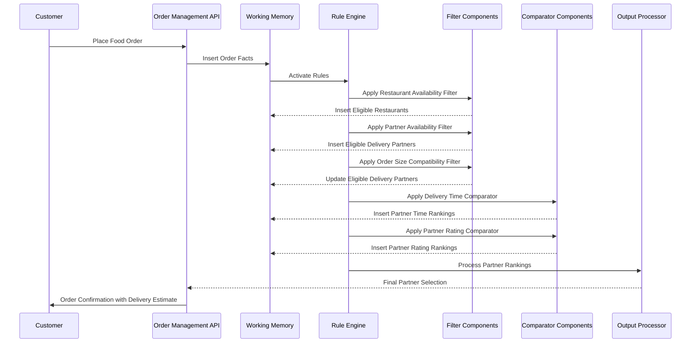

# Extending the Unified Routing Framework for Food Delivery

This document outlines how the unified routing framework can be extended to support food delivery services, demonstrating the adaptability of the architecture across different domains.

## Conceptual Mapping

| Framework Component | Payment Processing | Food Delivery Equivalent |
|---------------------|--------------------|-----------------------|
| Entities | Gateways, Merchants, Transactions | Restaurants, Delivery Partners, Orders, Customers |
| Filters | Gateway eligibility filters | Restaurant/delivery partner eligibility filters |
| Comparators | Success rate, latency ranking | Proximity, rating, preparation time ranking |
| Output Processors | Priority lists, volume splits | Delivery partner assignment strategies |
| Working Memory | Transaction contexts, gateway metrics | Order details, delivery partner metrics |

## Domain Entities

```java
// Core entities for food delivery domain
fact Restaurant {
    String restaurantId;
    String name;
    GeoLocation location;
    CuisineType cuisine;
    double rating;
    int preparationTimeMinutes;
    boolean isOpen;
    List<MenuItem> menu;
    RestaurantMetrics metrics;  // order volume, prep times, etc.
}

fact DeliveryPartner {
    String partnerId;
    String name;
    GeoLocation currentLocation;
    PartnerStatus status;  // available, busy, offline
    VehicleType vehicleType;
    double rating;
    PartnerMetrics metrics; // acceptance rate, delivery times, etc.
    List<String> specializations; // large orders, alcohol delivery, etc.
}

fact Customer {
    String customerId;
    String name;
    GeoLocation deliveryLocation;
    CustomerPreferences preferences;
    CustomerMetrics metrics;  // order history, ratings given, etc.
}

fact Order {
    String orderId;
    String customerId;
    String restaurantId;
    List<OrderItem> items;
    double totalAmount;
    timestamp orderTime;
    OrderStatus status;
    GeoLocation deliveryLocation;
    OrderSize size;  // small, medium, large
    List<String> specialRequirements;  // contactless, utensils, etc.
}
```

## Filter Components

```json
{
  "id": "restaurant_availability_filter",
  "type": "filter",
  "implementation": "RestaurantAvailabilityFilter",
  "config": {
    "max_delivery_radius_km": 5,
    "required_status": ["open", "accepting_orders"],
    "min_preparation_capacity": 2,
    "max_current_order_queue": 10
  }
}
```

```json
{
  "id": "delivery_partner_availability_filter",
  "type": "filter",
  "implementation": "DeliveryPartnerAvailabilityFilter",
  "config": {
    "max_distance_to_restaurant_km": 3,
    "statuses": ["available", "completing_delivery"],
    "max_remaining_minutes_in_current_delivery": 10,
    "vehicle_types": ["bike", "scooter", "car"]
  }
}
```

```json
{
  "id": "order_size_compatibility_filter",
  "type": "filter",
  "implementation": "OrderSizeCompatibilityFilter",
  "config": {
    "compatibility_matrix": {
      "small": ["bike", "scooter", "car"],
      "medium": ["scooter", "car"],
      "large": ["car"]
    },
    "vehicle_capacity_overrides": {
      "large_bike": ["medium"]
    }
  }
}
```

```json
{
  "id": "special_handling_filter",
  "type": "filter",
  "implementation": "SpecialHandlingFilter",
  "config": {
    "requirements_mapping": {
      "alcohol_delivery": "alcohol_certified",
      "contactless_delivery": "contactless_enabled",
      "food_temperature_control": "has_thermal_bag"
    }
  }
}
```

## Comparator Components

```json
{
  "id": "restaurant_proximity_comparator",
  "type": "comparator",
  "implementation": "RestaurantProximityComparator",
  "config": {
    "use_actual_route_distance": true,
    "traffic_conditions_factor": true,
    "max_delivery_time_minutes": 45
  }
}
```

```json
{
  "id": "delivery_time_comparator",
  "type": "comparator",
  "implementation": "DeliveryTimeComparator",
  "config": {
    "factors": {
      "restaurant_prep_time_weight": 0.4,
      "travel_time_weight": 0.6
    },
    "traffic_model": "real_time",
    "historical_accuracy_weight": 0.3
  }
}
```

```json
{
  "id": "partner_rating_comparator",
  "type": "comparator",
  "implementation": "PartnerRatingComparator",
  "config": {
    "minimum_ratings_required": 10,
    "recency_weight_factor": 0.8,
    "customer_preference_matching": true
  }
}
```

```json
{
  "id": "order_completion_rate_comparator",
  "type": "comparator",
  "implementation": "OrderCompletionRateComparator",
  "config": {
    "lookback_period_hours": 72,
    "minimum_delivery_threshold": 10,
    "penalty_for_cancellations": true
  }
}
```

## Output Processors

```json
{
  "id": "optimal_partner_processor",
  "type": "output_processor",
  "implementation": "OptimalPartnerProcessor",
  "config": {
    "timeout_seconds": 20,
    "max_partner_requests": 2,
    "sequential_offering": true,
    "auto_assignment_after_timeout": true
  }
}
```

```json
{
  "id": "batch_delivery_processor",
  "type": "output_processor",
  "implementation": "BatchDeliveryProcessor",
  "config": {
    "batch_window_seconds": 60,
    "optimization_objective": "minimize_total_delivery_time",
    "max_orders_per_batch": 3,
    "max_distance_between_drops_km": 2.5
  }
}
```

## Routing Algorithms

```json
{
  "id": "standard_delivery_algorithm",
  "name": "Standard Food Delivery Matching",
  "description": "Default algorithm for matching restaurants and delivery partners",
  "filters": [
    "restaurant_availability_filter",
    "delivery_partner_availability_filter",
    "order_size_compatibility_filter"
  ],
  "comparators": [
    {
      "id": "delivery_time_comparator",
      "weight": 0.6
    },
    {
      "id": "partner_rating_comparator", 
      "weight": 0.4
    }
  ],
  "output_processor": "optimal_partner_processor"
}
```

```json
{
  "id": "premium_delivery_algorithm",
  "name": "Premium Food Delivery Matching",
  "description": "Priority matching for premium customers or high-value orders",
  "filters": [
    "restaurant_availability_filter",
    "delivery_partner_availability_filter",
    "order_size_compatibility_filter"
  ],
  "comparators": [
    {
      "id": "partner_rating_comparator",
      "weight": 0.7
    },
    {
      "id": "delivery_time_comparator", 
      "weight": 0.3
    }
  ],
  "output_processor": "optimal_partner_processor"
}
```

```json
{
  "id": "batch_delivery_algorithm",
  "name": "Batch Delivery Optimization",
  "description": "Optimizes delivery partner efficiency by batching nearby orders",
  "filters": [
    "restaurant_availability_filter",
    "delivery_partner_availability_filter"
  ],
  "comparators": [
    {
      "id": "restaurant_proximity_comparator",
      "weight": 0.6
    },
    {
      "id": "order_completion_rate_comparator", 
      "weight": 0.4
    }
  ],
  "output_processor": "batch_delivery_processor"
}
```

## End-to-End Flow Example



## Configuration Example for Multi-Strategy Routing

```json
{
  "decider": {
    "id": "food_delivery_decider",
    "routing_algorithms": [
      {
        "id": "high_value_order_algorithm",
        "filters": [
          "restaurant_availability_filter",
          "delivery_partner_availability_filter",
          "order_size_compatibility_filter",
          "special_handling_filter"
        ],
        "comparators": [
          {
            "id": "partner_rating_comparator",
            "weight": 0.8
          },
          {
            "id": "delivery_time_comparator",
            "weight": 0.2
          }
        ],
        "output_processor": "optimal_partner_processor",
        "condition": "order.totalAmount > 50.0 || customer.customerType == 'PREMIUM'"
      },
      {
        "id": "rush_hour_algorithm",
        "filters": [
          "restaurant_availability_filter",
          "delivery_partner_availability_filter",
          "order_size_compatibility_filter"
        ],
        "comparators": [
          {
            "id": "delivery_time_comparator",
            "weight": 0.5
          },
          {
            "id": "order_completion_rate_comparator",
            "weight": 0.5
          }
        ],
        "output_processor": "batch_delivery_processor",
        "condition": "time_of_day.isRushHour() && city_zones.isHighOrderDensityZone(customer.deliveryLocation)"
      },
      {
        "id": "standard_delivery_algorithm",
        "filters": [
          "restaurant_availability_filter",
          "delivery_partner_availability_filter",
          "order_size_compatibility_filter"
        ],
        "comparators": [
          {
            "id": "delivery_time_comparator",
            "weight": 0.6
          },
          {
            "id": "partner_rating_comparator",
            "weight": 0.4
          }
        ],
        "output_processor": "optimal_partner_processor",
        "condition": "true" // Default case
      }
    ],
    "selection_strategy": "first_matching_condition"
  }
}
```

## Feedback Loop Integration

```json
{
  "id": "delivery_feedback_processor",
  "type": "feedback_processor",
  "implementation": "DeliveryFeedbackProcessor",
  "config": {
    "rating_weight_decay": 0.95,
    "recent_deliveries_window": 50,
    "customer_bias_correction": true,
    "automatic_action_thresholds": {
      "review_threshold": 2.5,
      "suspension_threshold": 2.0
    },
    "metrics_update_frequency_seconds": 300
  }
}
```

## Enhanced Features

### 1. Restaurant Load Balancing

```json
{
  "id": "restaurant_load_balancer",
  "type": "preprocessor",
  "implementation": "RestaurantLoadBalancer",
  "config": {
    "max_concurrent_orders": 15,
    "kitchen_capacity_factor": 0.8,
    "preparation_time_multiplier": {
      "10_orders": 1.2,
      "15_orders": 1.5,
      "20_orders": 2.0
    },
    "update_frequency_seconds": 60
  }
}
```

### 2. Weather-Adjusted Routing

```json
{
  "id": "weather_adjusted_algorithm",
  "filters": [
    "restaurant_availability_filter",
    "delivery_partner_availability_filter",
    "weather_safety_filter"
  ],
  "preprocessors": [
    {
      "id": "weather_condition_analyzer",
      "config": {
        "weather_delivery_time_multipliers": {
          "light_rain": 1.3,
          "heavy_rain": 1.8,
          "snow": 2.0,
          "fog": 1.5,
          "extreme_heat": 1.2
        },
        "restricted_vehicle_types": {
          "heavy_rain": ["bike"],
          "snow": ["bike", "scooter"],
          "extreme_weather": ["bike", "scooter"]
        }
      }
    }
  ],
  "comparators": [
    {
      "id": "delivery_time_comparator",
      "weight": 0.7
    },
    {
      "id": "partner_rating_comparator",
      "weight": 0.3
    }
  ],
  "output_processor": "optimal_partner_processor"
}
```

### 3. Multi-Restaurant Order Handling

```json
{
  "id": "multi_restaurant_order_algorithm",
  "filters": [
    "restaurant_availability_filter",
    "delivery_partner_availability_filter",
    "order_size_compatibility_filter"
  ],
  "matching": {
    "id": "multi_pickup_processor",
    "config": {
      "max_restaurants_per_batch": 3,
      "max_pickup_distance_km": 2.0,
      "max_total_preparation_time_minutes": 30,
      "staggered_pickup_scheduling": true
    }
  },
  "comparators": [
    {
      "id": "multi_pickup_efficiency_comparator",
      "weight": 0.7
    },
    {
      "id": "partner_rating_comparator",
      "weight": 0.3
    }
  ],
  "output_processor": "optimal_partner_processor"
}
```

## Advantages of the Framework in Food Delivery

1. **Data-Driven Decisions**: Leverage historical delivery data to optimize partner selection
2. **Adaptive Strategies**: Change routing strategies based on time of day, weather, or order load
3. **Real-Time Optimizations**: Adjust estimated delivery times based on current conditions
4. **Balanced Workload**: Distribute orders fairly among delivery partners
5. **Customer Satisfaction**: Prioritize quality and speed based on order importance
6. **Resource Optimization**: Batch orders efficiently to reduce per-delivery costs
7. **Simplified Configuration**: Modify routing behavior without code changes

## Cross-Domain Reusable Components

The following components could be shared between both cab services and food delivery domains:

1. **Geographic Distance Calculators**: Distance and ETA computation
2. **Rating-Based Filters/Comparators**: Service provider quality assessment
3. **Availability Filters**: Verifying service provider status and capacity
4. **Batch Assignment Logic**: Optimizing multiple assignments simultaneously
5. **Feedback Processors**: Collecting and processing user ratings
6. **Geographic Zone Management**: Managing service areas and special locations
7. **Time-of-Day Strategy Selectors**: Adapting to different times of day

## Conclusion

This extension demonstrates how the unified routing framework can be adapted to food delivery, showcasing its flexibility across different domains. The same core architecture of filters, comparators, and output processors provides a consistent approach to decision-making while domain-specific implementations address the unique requirements of food delivery services.

By leveraging this framework, a food delivery platform can achieve sophisticated routing and matching capabilities while maintaining a clean, maintainable, and extensible codebase.
