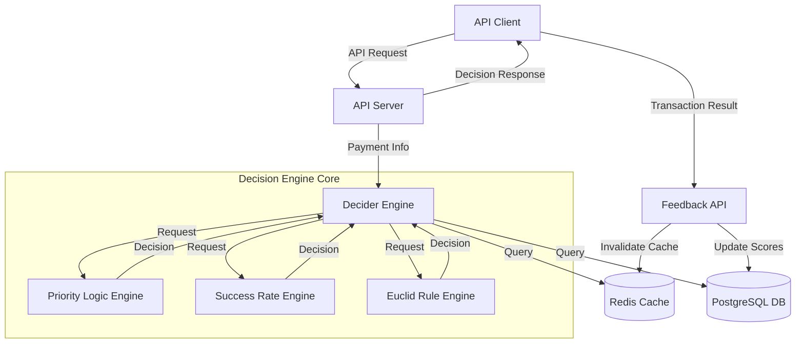
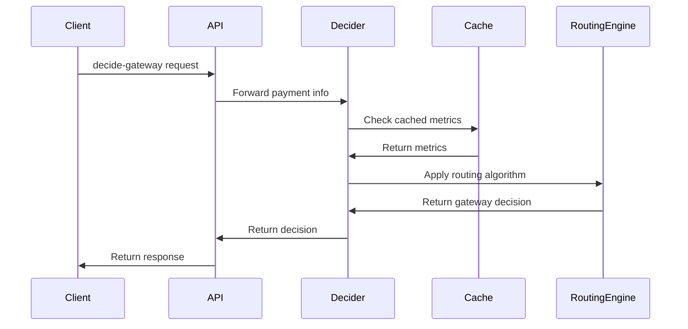
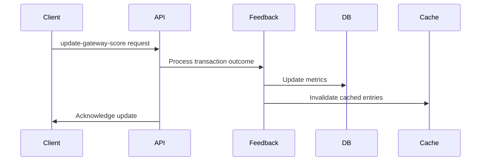

# Decision Engine - System Patterns

## System Architecture

The Decision Engine follows a modular architecture focused on high performance and reliability for payment gateway routing decisions.

## Core Components

### 1. API Layer

The API layer provides RESTful endpoints for gateway decisions and feedback, implemented using the axum framework in Rust.

Key endpoints:
- `/decide-gateway`: Determines the optimal gateway for a transaction
- `/update-gateway-score`: Updates success metrics based on transaction outcomes
- `/routing/*`: Endpoints for managing Euclid routing rules

Pattern: **Facade Pattern** - Providing a simplified interface to the complex routing logic.

### 2. Decider Engine

Central component that orchestrates decision-making based on various routing strategies:

- **Priority Logic**: Rule-based routing using predefined priority lists
- **Success Rate**: Data-driven routing based on historical performance
- **Euclid**: Advanced rule engine for complex business logic

Pattern: **Strategy Pattern** - Allowing different routing algorithms to be selected at runtime.

### 3. Storage Layer

Dual-storage approach for performance and persistence:

- **PostgreSQL**: For persistent storage of configurations, rules, and historical metrics
- **Redis**: For high-performance caching of frequently accessed data

Pattern: **Repository Pattern** - Abstracting the data access logic.

### 4. Feedback Loop

System for collecting and processing transaction outcomes to improve future routing decisions:

- Gateway score updates based on transaction results
- Automatic detection of gateway outages
- Performance metric calculation across various dimensions

Pattern: **Observer Pattern** - Reacting to transaction outcomes to update system state.

## Key Architectural Patterns

### 1. Multi-tenancy

The system is designed to support multiple merchants with isolated configurations:

- Tenant-specific database schemas
- Isolated Redis namespaces
- Merchant-specific routing configurations

Implementation: `TenantAppState` structure that encapsulates tenant-specific resources.

### 2. Command Query Responsibility Segregation (CQRS)

Separation between decision operations (queries) and feedback operations (commands):

- Read-optimized paths for gateway decisions
- Write-optimized paths for updating metrics

### 3. Caching Strategy

Multi-level caching approach:

- Redis for high-speed data access
- In-memory caching for ultra-low-latency operations
- Cache invalidation on feedback updates

### 4. Error Handling

Comprehensive error handling with structured error responses:

- Detailed error types for different failure scenarios
- Error propagation with context
- Client-friendly error messages

Implementation: `ErrorResponse` and `UnifiedError` structures.

## Data Flow Patterns

### 1. Decision Flow

### 2. Feedback Flow

## Concurrency Model

- **Asynchronous Processing**: Using Tokio for asynchronous task handling
- **Connection Pooling**: For database and Redis connections
- **Worker-based Processing**: For batch operations

## Resilience Patterns

### 1. Circuit Breaker

Detection of failing gateways and automatic removal from routing:

- Success rate threshold monitoring
- Automatic gateway elimination for poor performance
- Gradual reintroduction after recovery

### 2. Fallback Mechanisms

Multiple layers of fallback when preferred gateways are unavailable:

- Primary routing logic with fallback options
- Default routing when all custom logic fails

### 3. Graceful Shutdown

Controlled shutdown process for maintenance:

- Signal handling for SIGTERM
- Readiness flag management
- Connection draining period

Implementation: Signal handling in `app.rs`

## Extension Points

The system provides several extension points for customization:

1. **Custom Routing Algorithms**: Through the Euclid rule engine
2. **Merchant-specific Configurations**: Via configuration API
3. **Feedback Processors**: For custom metric calculations
4. **Monitoring Integrations**: Through structured logging
