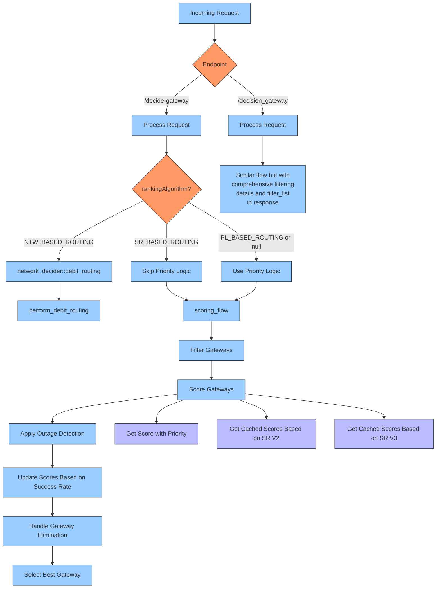
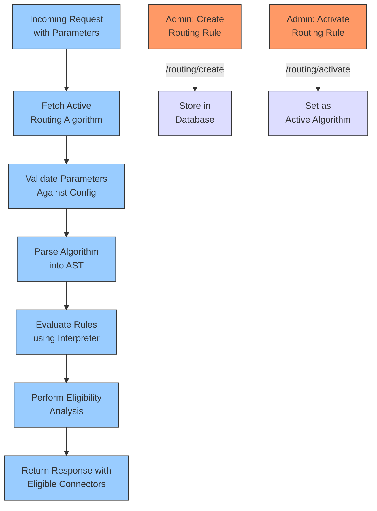

# Gateway Routing Endpoints

This document outlines the different gateway routing endpoints available in the Decision Engine and their respective routing algorithms.

## Endpoint Structure

The following diagram illustrates the organization of routing endpoints and the algorithms they support:

```mermaid
graph TD
    A[Decision Engine] --> B["/decide-gateway"]
    A --> C["/decision_gateway"]
    A --> R["/routing/evaluate"]
    
    B --> D[flow_new.rs Implementation]
    C --> E[flows.rs Implementation]
    R --> S[euclid/handlers/routing_rules.rs]
    
    %% /decide-gateway routing algorithms
    D --> F[Network-Based Routing<br>NTW_BASED_ROUTING]
    D --> G[Success Rate-Based Routing<br>SR_BASED_ROUTING]
    D --> H[Priority Logic-Based Routing<br>PL_BASED_ROUTING]
    
    %% /decision_gateway routing algorithms
    E --> J[Success Rate-Based Routing<br>SR_BASED_ROUTING]
    E --> K[Priority Logic-Based Routing<br>PL_BASED_ROUTING]
    
    %% /routing/evaluate algorithms
    S --> T[Rule-Based Routing<br>Euclid Engine]
    
    %% Network-Based Routing details
    F --> F1[Debit Routing]
    F --> F2[network_decider::debit_routing Module]
    
    %% Success Rate-Based Routing details for /decide-gateway
    G --> G1[SR V2 Routing]
    G --> G2[SR V3 Routing]
    G --> G3[Elimination]
    G --> G4[Hedging]
    
    %% Priority Logic-Based Routing details for /decide-gateway
    H --> H1[Merchant Priority]
    H --> H2[Fallback Logic]
    H --> H3[Outage Detection]
    
    %% Success Rate-Based Routing details for /decision_gateway
    J --> J1[SR V2 Routing]
    J --> J2[Elimination]
    
    %% Priority Logic-Based Routing details for /decision_gateway
    K --> K1[Merchant Priority]
    K --> K2[Fallback Logic]
    
    %% Rule-Based Routing details
    T --> T1[Priority Output]
    T --> T2[Volume Split Output]
    T --> T3[Volume Split Priority Output]

    %% Downtime Detection Types
    L[Downtime Detection Types]
    L --> L1[ALL_DOWNTIME]
    L --> L2[GLOBAL_DOWNTIME]
    L --> L3[DOWNTIME]
    L --> L4[NO_DOWNTIME]
    
    %% SR Based Routing Features
    M[SR Based Routing Features]
    M --> M1[Dynamic Bucket Size]
    M --> M2[Gateway Reset]
    M --> M3[Explore & Exploit]
    M --> M4[Statistical Modeling]
    
    %% Connect common features to respective algorithms
    G --> L
    G --> M
    J --> L
    
    %% Response Types
    B --> B1[Returns DecidedGateway]
    C --> C1[Returns DecidedGatewayResponse<br>with filter_list]
    R --> R1[Returns EligibleConnectors<br>with Output Type]
    
    classDef endpoint fill:#f96,stroke:#333,stroke-width:2px;
    classDef implementation fill:#9cf,stroke:#333,stroke-width:1px;
    classDef algorithm fill:#bbf,stroke:#333;
    classDef feature fill:#ddf,stroke:#333;
    
    class B,C,R endpoint;
    class D,E,S implementation;
    class F,G,H,J,K,T algorithm;
    class F1,F2,G1,G2,G3,G4,H1,H2,H3,J1,J2,K1,K2,T1,T2,T3,L1,L2,L3,L4,M1,M2,M3,M4,B1,C1,R1 feature;
```

## Decision Flow Process

The following diagram illustrates the decision flow process for the gateway decision endpoints:

## Key Differences Between Gateway Decision Endpoints

1. **Implementation**:
   - `/decide-gateway`: Uses the newer `flow_new.rs` implementation
   - `/decision_gateway`: Uses the older `flows.rs` implementation

2. **Request Models**:
   - `/decide-gateway`: Uses `DomainDeciderRequestForApiCallV2`
   - `/decision_gateway`: Uses `DomainDeciderRequest`

3. **Routing Algorithms**:
   - `/decide-gateway`: Supports NTW_BASED_ROUTING (exclusive), SR_BASED_ROUTING, and PL_BASED_ROUTING
   - `/decision_gateway`: Supports only SR_BASED_ROUTING and PL_BASED_ROUTING

4. **Response Detail**:
   - `/decide-gateway`: Returns a streamlined `DecidedGateway` response
   - `/decision_gateway`: Returns a more detailed `DecidedGatewayResponse` with comprehensive filter_list for debugging

5. **Advanced Features in `/decide-gateway`**:
   - Network-based debit routing
   - SR V3 routing with advanced statistical models
   - Hedging capability for distributing traffic
   - More sophisticated downtime detection and handling

## Rule-Based Routing with `/routing/evaluate`

The `/routing/evaluate` endpoint provides rule-based routing decisions using the Euclid rules engine. This endpoint differs from the gateway decision endpoints as it evaluates custom routing rules defined by merchants rather than using predefined routing algorithms.

### Flow Diagram

### Rule-Based Routing Process

1. **Rule Creation**: Merchants create custom routing rules using the `/routing/create` endpoint
2. **Rule Activation**: A specific rule is activated using `/routing/activate`
3. **Rule Evaluation**: When `/routing/evaluate` is called:
   - The system fetches the active routing algorithm for the merchant
   - Parameters are validated against routing configuration
   - The algorithm is parsed and evaluated using Euclid interpreter
   - Eligibility analysis is performed using constraint graphs
   - Response includes eligible connectors ordered by priority or split by volume

### Key Features

- **Custom Rules**: Merchants can define their own routing logic
- **Multiple Output Types**:
  - Priority-based (ordered list of connectors)
  - Volume-split (percentage allocation to connectors)
  - Volume-split-priority (combination of both)
- **Constraint-Based Filtering**: Automatically filters out ineligible connectors
- **Versioning**: Supports multiple rule versions with activation control

### Integration with Gateway Decision Flow

The rule-based routing can be used as a preliminary step before the gateway decision process. The eligible connectors from `/routing/evaluate` can be used to narrow down the gateway list before applying Success Rate or Priority Logic routing.
