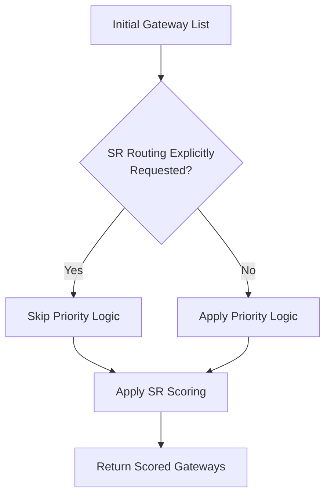

# Success Rate and Priority Logic Routing Interaction

This document explains how Success Rate-Based (SR) and Priority Logic-Based (PL) routing algorithms interact within the Decision Engine, along with a detailed example of the decision flow process.

## SR and PL Coexistence

The Success Rate and Priority Logic routing algorithms coexist within the same decision engine but serve different purposes:

1. **Priority Logic (PL)** provides the initial ordering of gateways based on merchant-defined preferences
2. **Success Rate (SR)** modifies these scores based on historical performance data

These algorithms are implemented in both `flow_new.rs` (for `/decide-gateway`) and `flows.rs` (for `/decision_gateway`), though with different capabilities.

### Implementation Interaction

The routing process uses these algorithms in sequence:



Key points:
- If `rankingAlgorithm == SR_BASED_ROUTING`, the system skips priority logic entirely
- Otherwise, priority logic creates initial scores, then SR modifies them
- The updated scores determine the final gateway selection

## Detailed Decision Flow Example

Let's follow a transaction through the `/decide-gateway` endpoint to understand how each step works:

### Example Scenario

A customer is making a credit card payment of ₹1000 for an e-commerce purchase:

- Payment Method: Credit Card
- Card Type: Visa
- Amount: ₹1000
- Merchant: E-commerce site
- Available Gateways: Razorpay, PayU, Cashfree, Stripe

### Step 1: Request Processing

```json
{
  "paymentInfo": {
    "paymentId": "payment_12345",
    "amount": 1000,
    "currency": "INR",
    "customerId": "cust_789",
    "paymentMethodType": "CARD",
    "paymentMethod": "credit_card",
    "cardIsin": "411111",
    "cardType": "VISA"
  },
  "merchantId": "merchant_456",
  "eligibleGatewayList": null,
  "rankingAlgorithm": "PL_BASED_ROUTING"
}
```

This request is processed by `decide_gateway` endpoint, which calls `deciderFullPayloadHSFunction` in `flow_new.rs`.

### Step 2: Gateway Filtering

The system applies multiple filters to determine eligible gateways:

1. **Currency Filtering**: Only gateways supporting INR remain
2. **Card Brand Filtering**: Only gateways supporting Visa remain
3. **Auth Type Filtering**: Based on card authentication requirements
4. **Payment Method Filtering**: Based on credit card compatibility

After filtering, assume all four gateways (Razorpay, PayU, Cashfree, Stripe) remain eligible.

### Step 3: Priority Logic Application

Since `rankingAlgorithm` is `PL_BASED_ROUTING`, the system applies the merchant's priority logic. This is implemented in the `get_gateway_priority` function.

The merchant has configured their priority as:
1. Razorpay (1.0)
2. PayU (0.9)
3. Cashfree (0.8)
4. Stripe (0.7)

The code snippet that handles this:

```rust
let gateway_priority_list = addPreferredGatewaysToPriorityList(gwPLogic.gws.clone(), preferredGateway.clone());
// ...
let currentGatewayScoreMap = GS::get_score_with_priority(
    uniqueFunctionalGateways.clone(),
    gateway_priority_list.clone(),
);
```

After this step, the gateway scores are:
- Razorpay: 1.0
- PayU: 0.9
- Cashfree: 0.8
- Stripe: 0.7

### Step 4: Success Rate-Based Scoring

Even though we're using PL_BASED_ROUTING, success rate metrics still modify these scores. This step involves:

1. **Outage Detection**: Check if any gateways are experiencing outages
   ```rust
   update_score_for_outage(decider_flow).await;
   ```
   
   Let's say Cashfree has a detected outage, reducing its score:
   - Cashfree: 0.8 → 0.08 (penalized by factor of 10)
   
2. **Success Rate Evaluation**:  
   ```rust
   update_gateway_score_based_on_success_rate(
       decider_flow,
       is_sr_v3_metric_enabled,
       current_gateway_score_map,
       gateway_scoring_data.clone(),
       elimination_enabled,
   )
   ```
   
   This examines historical success rates and may penalize poorly performing gateways.
   Let's say PayU has been performing poorly, reducing its score:
   - PayU: 0.9 → 0.18 (penalized by factor of 5)

After these adjustments, the scores are:
- Razorpay: 1.0
- PayU: 0.18
- Cashfree: 0.08
- Stripe: 0.7

### Step 5: Gateway Selection

The gateway with the highest score is selected:

```rust
let decidedGateway = Utils::random_gateway_selection_for_same_score(
    &currentGatewayScoreMap,
    maxScore,
);
```

In our example, Razorpay with a score of 1.0 is selected.

### Step 6: Response Construction

The final response is constructed with the decided gateway and supporting information:

```rust
Ok(T::DecidedGateway {
    decided_gateway: decideGatewayOutput,
    gateway_priority_map: gatewayPriorityMap,
    filter_wise_gateways: None,
    priority_logic_tag: updatedPriorityLogicOutput.priorityLogicTag.clone(),
    routing_approach: finalDeciderApproach.clone(),
    gateway_before_evaluation: topGatewayBeforeSRDowntimeEvaluation.clone(),
    priority_logic_output: Some(updatedPriorityLogicOutput),
    reset_approach: decider_flow.writer.reset_approach.clone(),
    routing_dimension: decider_flow.writer.routing_dimension.clone(),
    routing_dimension_level: decider_flow.writer.routing_dimension_level.clone(),
    is_scheduled_outage: decider_flow.writer.isScheduledOutage,
    is_dynamic_mga_enabled: decider_flow.writer.is_dynamic_mga_enabled,
    gateway_mga_id_map: None,
    debit_routing_output: None,
})
```

Response:
```json
{
  "decided_gateway": "Razorpay",
  "gateway_priority_map": {
    "Razorpay": 1.0,
    "Stripe": 0.7,
    "PayU": 0.18,
    "Cashfree": 0.08
  },
  "routing_approach": "PRIORITY_LOGIC",
  "gateway_before_evaluation": null,
  "reset_approach": "NO_RESET",
  "is_scheduled_outage": true
}
```

## SR-First Example (Alternative Flow)

If the request had specified `"rankingAlgorithm": "SR_BASED_ROUTING"`, the flow would change:

1. The system would skip applying the merchant's priority list
2. Instead, it would directly use success rate metrics to score gateways:

```rust
if rankingAlgorithm == Some(RankingAlgorithm::SR_BASED_ROUTING) {
    // Skip priority logic output
}
```

The system would retrieve cached success rate scores from Redis:
```rust
let initial_sr_gw_scores = get_cached_scores_based_on_srv3(
    decider_flow,
    merchant_sr_v3_input_config,
    default_sr_v3_input_config,
    pm_str,
    gateway_scoring_data,
).await;
```

These scores might look like:
- Razorpay: 0.95 (95% success rate)
- PayU: 0.82 (82% success rate)
- Cashfree: 0.91 (91% success rate)
- Stripe: 0.89 (89% success rate)

In this case, Cashfree might have a better success rate generally but is experiencing an outage, so after outage detection:
- Razorpay: 0.95
- PayU: 0.82
- Cashfree: 0.091 (penalized due to outage)
- Stripe: 0.89

The system would select Razorpay (highest score) and set the routing approach to `SR_SELECTION_V3_ROUTING`.

## SR V3 Specific Features

For the newer SR V3 implementation (only in `/decide-gateway`), additional features include:

1. **Dynamic Bucket Size**: Success rate calculations use configurable window sizes
   ```rust
   let merchant_bucket_size = Utils::get_sr_v3_bucket_size(
       merchant_srv3_input_config.clone(), 
       pmt_str, 
       &pm
   ).unwrap_or(C::DEFAULT_SR_V3_BASED_BUCKET_SIZE);
   ```

2. **Statistical Distribution**: Beta or Binomial distributions to improve robustness
   ```rust
   let final_score_map_after_distribution = sample_from_binomial_distribution(
       final_score_map.clone(),
       merchant_bucket_size,
       gw.clone(),
   );
   ```

3. **Hedging**: Can distribute small percentages of traffic to lower-scored gateways
   ```rust
   let hedging_percent = Utils::get_sr_v3_hedging_percent(
       merchant_sr_v3_input_config.clone(),
       &pmt_str,
       pm.clone().as_str(),
   ).unwrap_or(C::defaultSrV3BasedHedgingPercent);
   ```

4. **Exploration vs Exploitation**: Balance between using known best gateways and exploring alternatives
   ```rust
   let should_explore = if is_explore_and_exploit_enabled {
       Utils::route_random_traffic_to_explore(
           hedging_percent,
           functional_gateways.clone(),
           "SR_BASED_V3_ROUTING".to_string(),
       )
   } else {
       false
   };
   ```

This advanced implementation significantly improves the robustness of the gateway selection process.
