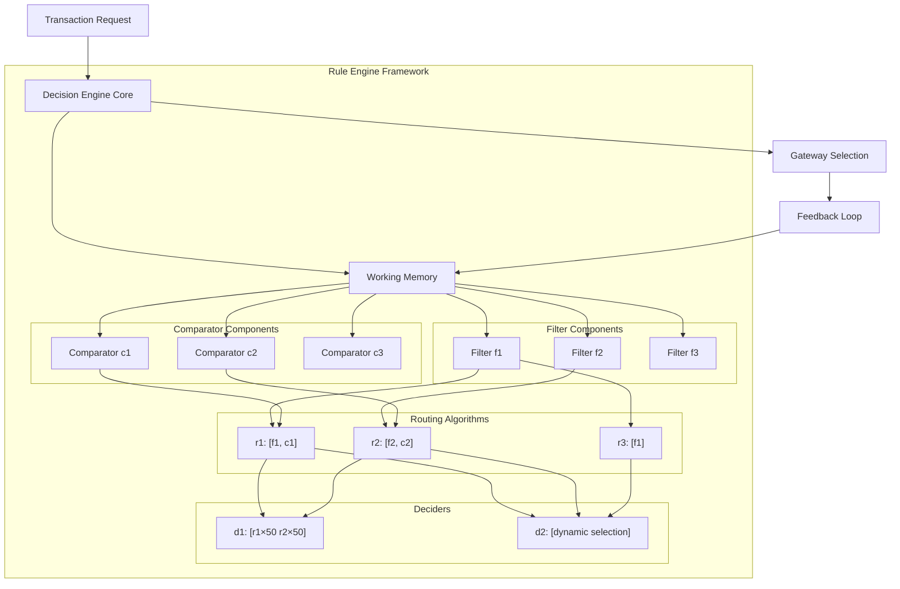

# Unified Routing Framework with Drools-like Architecture

## Overview

This document outlines a proposal for implementing a unified routing framework for the Decision Engine using a Drools-like rule engine architecture. The goal is to create a single, cohesive system that can handle all routing types through a composable, modular approach.

## Conceptual Architecture



## Core Components

### 1. Working Memory

Similar to Drools, the core of the system is a working memory that contains:

- **Facts**: Data representing transaction details, gateway statuses, performance metrics, etc.
- **Rules**: Patterns that match against facts to determine when actions should be triggered
- **Agenda**: Prioritized list of rule activations waiting to be executed

### 2. Filter Components (f1, f2, f3)

Filters are rule-based components that determine gateway eligibility:

```java
// Example filter in a Drools-like syntax
rule "International card filter (f1)"
when
    $transaction: Transaction(cardIssuerCountry != "IN")
    $gateway: Gateway()
    // Check if gateway supports international transactions
    eval(GatewayRegistry.supportsInternational($gateway.getId()))
then
    insertLogical(new EligibleGateway($gateway, "international_support"));
end
```

### 3. Comparator Components (c1, c2, c3)

Comparators evaluate and rank eligible gateways:

```java
// Example comparator in a Drools-like syntax
rule "Success rate comparator (c1)"
salience 100 // Higher priority
when
    $eligibleGateway1: EligibleGateway($g1: gateway)
    $eligibleGateway2: EligibleGateway($g2: gateway, gateway.id != $g1.id)
    $metrics: GatewayMetrics()
    // Compare success rates
    eval($metrics.getSuccessRate($g1.getId()) > $metrics.getSuccessRate($g2.getId()))
then
    insertLogical(new GatewayPreference($g1, $g2, "success_rate"));
end
```

### 4. Routing Algorithms (r1, r2, r3)

Routing algorithms are composites of filters and comparators with specific configurations:

```json
{
  "id": "r1",
  "name": "High Success Rate International Routing",
  "filters": ["f1"],  // International card filter
  "comparators": ["c1"],  // Success rate comparator
  "metadata": {
    "description": "Routes international transactions to gateways with highest success rates"
  }
}
```

### 5. Deciders (d1, d2)

Deciders are higher-order components that manage routing algorithms:

```json
{
  "id": "d1",
  "name": "Split Test Decider",
  "routing_algorithms": [
    {"id": "r1", "weight": 50},
    {"id": "r2", "weight": 50}
  ],
  "selection_strategy": "weighted_random",
  "metadata": {
    "description": "A/B testing between two routing algorithms"
  }
}
```

## Data Shape

### Request Attributes
- Transaction details (amount, currency, payment method, etc.)
- Card details (type, brand, issuing country, etc.)
- Customer details (location, history, etc.)

### Entity Attributes
- Gateway success rates
- Gateway latency metrics
- Gateway availability status
- Cost structures

## Mapping Current Routing Types to the Unified Framework

### 1. Priority Logic (PL_v1)

Maps to a filter-only routing algorithm:

```json
{
  "id": "pl_v1_equivalent",
  "filters": ["merchant_rules_filter", "card_type_filter", "amount_filter"],
  "comparators": [],
  "output_processor": "ordered_list_processor"
}
```

### 2. Euclid Rule Engine (PL_v2)

Maps to a filter with custom output processor:

```json
{
  "id": "pl_v2_equivalent",
  "filters": ["euclid_dsl_filter"],
  "comparators": [],
  "output_processor": "euclid_output_processor",
  "output_types": ["priority", "volume_split", "volume_split_priority"]
}
```

### 3. Success Rate Based Routing

Maps to a filter + comparator combination:

```json
{
  "id": "success_rate_equivalent",
  "filters": ["eligibility_filter"],
  "comparators": ["success_rate_comparator", "latency_comparator"],
  "weights": {
    "success_rate_comparator": 0.7,
    "latency_comparator": 0.3
  },
  "output_processor": "ranked_list_processor"
}
```

### 4. Elimination-based Routing

Maps to a specialized filter:

```json
{
  "id": "elimination_equivalent",
  "filters": ["threshold_elimination_filter"],
  "filter_config": {
    "threshold_elimination_filter": {
      "threshold": 0.75,
      "lookback_period": "7d"
    }
  },
  "output_processor": "filtered_list_processor"
}
```

## Implementation Strategy

### Phase 1: Core Framework

1. Implement the rule engine core with working memory
2. Create the component registries
3. Develop the configuration system
4. Build basic filters and comparators

### Phase 2: Legacy Integration

1. Create adapters for existing routing algorithms
2. Implement compatibility layer for legacy systems
3. Develop migration tools

### Phase 3: New Features

1. Add support for A/B testing and dynamic selection
2. Implement advanced analytics and monitoring
3. Build simulation and testing tools

## Benefits

1. **Modularity**: Components can be developed, tested, and maintained independently
2. **Reusability**: Filters and comparators can be reused across different routing algorithms
3. **Flexibility**: New routing strategies can be created by combining existing components
4. **Transparency**: Clear separation of concerns makes the system easier to understand
5. **Extensibility**: New filters, comparators, and output processors can be added without changing the core
6. **Performance**: Components can be optimized individually for their specific tasks
7. **Testing**: Components can be tested in isolation, improving reliability
8. **Business Agility**: New routing algorithms can be deployed without code changes

## Example Use Case: Multi-Region Merchant

A merchant operating in multiple regions with different payment preferences:

```json
{
  "decider": {
    "id": "multi_region_merchant",
    "routing_algorithms": [
      {
        "id": "domestic_transactions",
        "filters": [
          {"id": "domestic_filter", "config": {"countries": ["IN"]}},
          {"id": "payment_method_filter", "config": {"methods": ["CARD", "UPI", "NETBANKING"]}}
        ],
        "comparators": [
          {"id": "success_rate_comparator", "weight": 0.6},
          {"id": "cost_comparator", "weight": 0.4}
        ],
        "conditions": "transaction.country == 'IN'"
      },
      {
        "id": "international_high_value",
        "filters": [
          {"id": "international_filter", "config": {"excluded_countries": ["IN"]}},
          {"id": "amount_filter", "config": {"min_amount": 1000}}
        ],
        "comparators": [
          {"id": "success_rate_comparator", "weight": 0.8},
          {"id": "latency_comparator", "weight": 0.2}
        ],
        "conditions": "transaction.country != 'IN' && transaction.amount >= 1000"
      },
      {
        "id": "international_regular",
        "filters": [
          {"id": "international_filter", "config": {"excluded_countries": ["IN"]}},
          {"id": "amount_filter", "config": {"max_amount": 999.99}}
        ],
        "comparators": [
          {"id": "success_rate_comparator", "weight": 0.5},
          {"id": "cost_comparator", "weight": 0.5}
        ],
        "conditions": "transaction.country != 'IN' && transaction.amount < 1000"
      }
    ],
    "selection_strategy": "condition_match",
    "fallback": "domestic_transactions"
  }
}
```

## Technical Considerations

1. **Performance**: Optimize the rule evaluation for sub-millisecond response times
2. **Scalability**: Design for horizontal scaling to handle high transaction volumes
3. **Persistence**: Store configurations in a versioned database
4. **Monitoring**: Implement comprehensive metrics collection for observability
5. **Security**: Ensure tenant isolation and access controls
6. **Error Handling**: Provide robust fallback mechanisms

## Next Steps

1. Conduct a detailed technical feasibility assessment
2. Create a proof-of-concept implementation
3. Benchmark performance against current routing algorithms
4. Develop a migration plan for existing merchants
