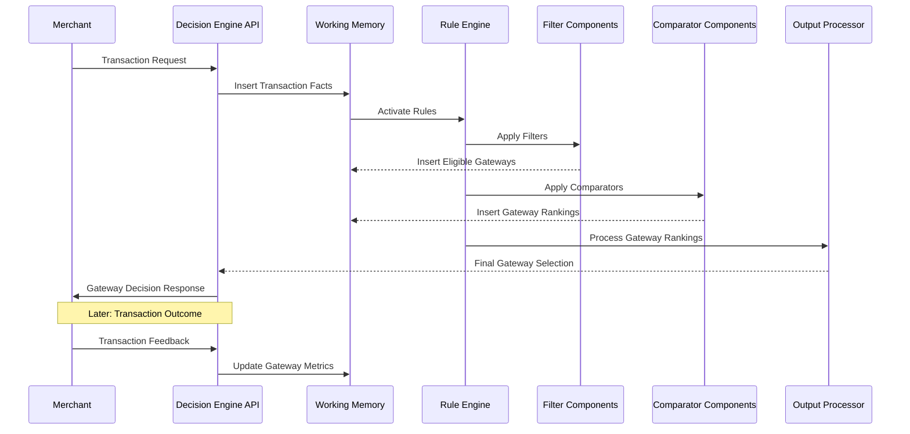
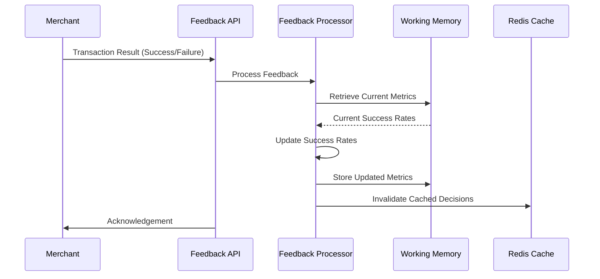

# Unified Routing Framework in Practice

This document shows how the unified Drools-like routing framework would operate in real-world scenarios, with practical examples of the entire system working together.

## End-to-End Transaction Flow

Here's how a transaction would flow through the unified system:



## Example: Multi-Tenant E-commerce Platform

Consider an e-commerce platform with multiple merchants, each having different routing needs:

### 1. System Configuration

```json
{
  "system": {
    "available_filters": [
      "euclid_rule_filter",
      "elimination_threshold_filter",
      "card_type_filter",
      "payment_method_filter",
      "amount_range_filter",
      "country_filter",
      "time_of_day_filter"
    ],
    "available_comparators": [
      "success_rate_comparator",
      "latency_comparator",
      "cost_comparator",
      "volume_commitment_comparator"
    ],
    "available_output_processors": [
      "priority_list_processor",
      "volume_split_processor",
      "ranked_list_processor"
    ]
  }
}
```

### 2. Merchant-Specific Configurations

#### Merchant A: Fashion Retailer with International Presence

```json
{
  "merchant_id": "fashion_retailer_123",
  "decider": {
    "id": "international_fashion_decider",
    "routing_algorithms": [
      {
        "id": "premium_customer_routing",
        "filters": [
          {
            "id": "customer_segment_filter",
            "config": {
              "premium_segments": ["VIP", "LOYALTY_PLATINUM"]
            }
          }
        ],
        "output_processor": {
          "id": "priority_output_processor",
          "config": {
            "default_output": {
              "type": "priority",
              "gateways": ["stripe", "adyen", "braintree"]
            }
          }
        },
        "condition": "transaction.customer_segment in ['VIP', 'LOYALTY_PLATINUM']"
      },
      {
        "id": "international_routing",
        "filters": [
          {
            "id": "euclid_rule_filter",
            "config": {
              "rules": [
                {
                  "name": "US Customer Rule",
                  "condition": [
                    {
                      "lhs": "payment.cardIssuerCountry",
                      "comparison": "equal",
                      "value": {"type": "string_value", "value": "US"}
                    }
                  ],
                  "tag": "us_customer"
                },
                {
                  "name": "EU Customer Rule",
                  "condition": [
                    {
                      "lhs": "payment.cardIssuerCountry",
                      "comparison": "in",
                      "value": {"type": "global_ref", "value": "eu_countries"}
                    }
                  ],
                  "tag": "eu_customer"
                }
              ]
            }
          }
        ],
        "output_processor": {
          "id": "priority_output_processor",
          "config": {
            "rules": [
              {
                "tag": "us_customer",
                "output": {
                  "type": "priority",
                  "gateways": ["stripe", "braintree", "adyen"]
                }
              },
              {
                "tag": "eu_customer",
                "output": {
                  "type": "priority",
                  "gateways": ["adyen", "stripe", "braintree"]
                }
              }
            ],
            "default_output": {
              "type": "priority",
              "gateways": ["stripe", "adyen", "razorpay", "braintree"]
            }
          }
        },
        "condition": "transaction.cardIssuerCountry != 'IN'"
      },
      {
        "id": "domestic_success_rate_routing",
        "filters": [
          {
            "id": "elimination_threshold_filter",
            "config": {
              "global_threshold": 0.75,
              "lookback_period_days": 7
            }
          }
        ],
        "comparators": [
          {
            "id": "success_rate_comparator",
            "config": {
              "dimensions": [
                {"name": "card_brand", "weight": 0.5},
                {"name": "amount_range", "weight": 0.3},
                {"name": "time_of_day", "weight": 0.2}
              ]
            },
            "weight": 0.7
          },
          {
            "id": "latency_comparator",
            "weight": 0.3
          }
        ],
        "output_processor": "ranked_list_processor",
        "condition": "transaction.cardIssuerCountry == 'IN'"
      }
    ],
    "selection_strategy": "first_matching_condition",
    "fallback": "domestic_success_rate_routing"
  }
}
```

#### Merchant B: Local Food Delivery Service

```json
{
  "merchant_id": "food_delivery_456",
  "decider": {
    "id": "food_delivery_decider",
    "routing_algorithms": [
      {
        "id": "volume_split_test",
        "filters": [],
        "output_processor": {
          "id": "volume_split_processor",
          "config": {
            "default_output": {
              "type": "volume_split",
              "splits": [
                {"gateway": "razorpay", "weight": 50},
                {"gateway": "paytm", "weight": 50}
              ]
            }
          }
        },
        "condition": "transaction.amount < 500"
      },
      {
        "id": "success_rate_routing",
        "filters": [
          {
            "id": "elimination_threshold_filter",
            "config": {
              "global_threshold": 0.80
            }
          }
        ],
        "comparators": [
          {
            "id": "success_rate_comparator",
            "weight": 1.0
          }
        ],
        "output_processor": "ranked_list_processor",
        "condition": "true"
      }
    ],
    "selection_strategy": "first_matching_condition"
  }
}
```

## Working Memory Example

During a transaction, the working memory would contain facts like:

```java
// Transaction Facts
TransactionRequest {
  transactionId: "tx_123456789",
  merchantId: "fashion_retailer_123",
  amount: 2500.00,
  currency: "USD",
  cardBrand: "VISA",
  cardType: "CREDIT",
  cardIssuerCountry: "US",
  customerSegment: "REGULAR",
  timeOfDay: "EVENING"
}

// Available Gateways
Gateway {
  id: "stripe",
  name: "Stripe",
  features: ["3DS", "RECURRING", "REFUND"],
  supportedPaymentMethods: ["CARD", "APPLE_PAY", "GOOGLE_PAY"],
  supportedCountries: ["US", "CA", "EU", "AU", "IN"]
}

Gateway {
  id: "adyen",
  name: "Adyen",
  features: ["3DS", "RECURRING", "REFUND"],
  supportedPaymentMethods: ["CARD", "APPLE_PAY", "GOOGLE_PAY", "IDEAL"],
  supportedCountries: ["US", "CA", "EU", "AU", "IN"]
}

Gateway {
  id: "braintree",
  name: "Braintree",
  features: ["3DS", "RECURRING", "REFUND"],
  supportedPaymentMethods: ["CARD", "PAYPAL", "VENMO"],
  supportedCountries: ["US", "CA", "EU", "AU"]
}

Gateway {
  id: "razorpay",
  name: "Razorpay",
  features: ["3DS", "RECURRING", "REFUND"],
  supportedPaymentMethods: ["CARD", "UPI", "NETBANKING"],
  supportedCountries: ["IN"]
}

// Gateway Metrics
GatewaySuccessMetrics {
  gatewayId: "stripe",
  dimensionSuccessRates: {
    "VISA": 0.95,
    "US": 0.96,
    "CREDIT": 0.94,
    "EVENING": 0.93
  },
  overallSuccessRate: 0.94,
  transactionCount: 1250
}

GatewaySuccessMetrics {
  gatewayId: "adyen",
  dimensionSuccessRates: {
    "VISA": 0.92,
    "US": 0.91,
    "CREDIT": 0.93,
    "EVENING": 0.92
  },
  overallSuccessRate: 0.92,
  transactionCount: 980
}

GatewaySuccessMetrics {
  gatewayId: "braintree",
  dimensionSuccessRates: {
    "VISA": 0.90,
    "US": 0.92,
    "CREDIT": 0.91,
    "EVENING": 0.89
  },
  overallSuccessRate: 0.91,
  transactionCount: 750
}
```

## Processing Steps for Sample Transaction

For the transaction above:

### 1. Rule Activation

The rule engine would activate the International Routing algorithm based on condition `transaction.cardIssuerCountry != 'IN'`.

### 2. Filter Application

The Euclid rule filter would evaluate the transaction against its rules:

```
Rule "US Customer Rule" matches because payment.cardIssuerCountry == "US"
Tag "us_customer" added to working memory
```

### 3. Output Processing

The priority output processor would select the gateway list for the "us_customer" tag:

```
Selected gateway priority: ["stripe", "braintree", "adyen"]
```

### 4. Final Decision

The system returns the final decision:

```json
{
  "primary_gateway": "stripe",
  "fallback_gateways": ["braintree", "adyen"],
  "routing_algorithm_id": "international_routing",
  "rule_matched": "US Customer Rule",
  "explanation": {
    "reason": "Transaction from US customer matched the US customer rule",
    "filter_results": [
      {
        "filter_id": "euclid_rule_filter",
        "matched_rules": ["US Customer Rule"],
        "tags_added": ["us_customer"]
      }
    ]
  }
}
```

## Example: Combining PL_v2 and Success Rate

Here's how a merchant might combine PL_v2 (Euclid) and Success Rate algorithms in a single configuration:

```json
{
  "merchant_id": "hybrid_merchant_789",
  "decider": {
    "id": "hybrid_decider",
    "routing_algorithms": [
      {
        "id": "rule_based_then_success_rate",
        "description": "Apply business rules first, then optimize with success rates",
        "filters": [
          {
            "id": "euclid_rule_filter",
            "config": {
              "rules": [
                {
                  "name": "High Value Transaction",
                  "condition": [
                    {
                      "lhs": "order.amount",
                      "comparison": "greater_than",
                      "value": {"type": "number", "value": 10000}
                    }
                  ],
                  "tag": "high_value"
                }
              ]
            }
          },
          {
            "id": "elimination_threshold_filter",
            "config": {
              "global_threshold": 0.80
            }
          }
        ],
        "comparators": [
          {
            "id": "success_rate_comparator",
            "config": {
              "dimensions": [
                {"name": "card_brand", "weight": 0.4},
                {"name": "amount_range", "weight": 0.4},
                {"name": "time_of_day", "weight": 0.2}
              ]
            },
            "weight": 1.0,
            "condition": "!context.tags.contains('high_value')"
          }
        ],
        "output_processor": {
          "id": "conditional_output_processor",
          "config": {
            "rules": [
              {
                "tag": "high_value",
                "processor": {
                  "id": "priority_output_processor",
                  "config": {
                    "default_output": {
                      "type": "priority",
                      "gateways": ["adyen", "stripe", "braintree"]
                    }
                  }
                }
              }
            ],
            "default_processor": "ranked_list_processor"
          }
        }
      }
    ]
  }
}
```

In this example:

1. The Euclid rule filter identifies high-value transactions and tags them
2. All transactions go through the elimination threshold filter to remove poorly performing gateways
3. For non-high-value transactions, gateways are ranked by success rate
4. High-value transactions use a fixed priority list
5. The conditional output processor selects the appropriate output format based on tags

## Transaction Feedback Flow

When a transaction completes, the feedback flow updates the working memory:



## Multi-Tenant Memory Isolation

The working memory would be isolated by tenant to ensure separation of data:

```
WorkingMemory
├── Global Facts
│   ├── System Configuration
│   └── Global Gateway Registry
├── Tenant: fashion_retailer_123
│   ├── Tenant Configuration
│   ├── Gateway Success Metrics
│   └── Transaction Context (Session Scoped)
├── Tenant: food_delivery_456
│   ├── Tenant Configuration
│   ├── Gateway Success Metrics
│   └── Transaction Context (Session Scoped)
└── Tenant: hybrid_merchant_789
    ├── Tenant Configuration
    ├── Gateway Success Metrics
    └── Transaction Context (Session Scoped)
```

## Performance Optimizations

To achieve sub-millisecond performance:

1. **Rule Compilation**: At system startup, all rule definitions are compiled into optimized structures
2. **Caching Layer**: Frequently accessed data like success metrics are cached in Redis
3. **Pattern Indexing**: The rule engine indexes patterns for fast matching
4. **Stateless Evaluation**: Each transaction evaluation is stateless, allowing for horizontal scaling
5. **Asynchronous Feedback**: Transaction feedback is processed asynchronously

## Practical Resilience Features

1. **Fallback Chains**: If primary gateway selection fails, the system has clear fallback paths
2. **Circuit Breakers**: Automatic detection of gateway outages based on recent failures
3. **Rule Validation**: Rules are validated at upload time to prevent runtime errors
4. **Monitoring Hooks**: Each component emits metrics for operational visibility

## Deployment Considerations

1. **Configuration Management**: Use a versioned database for storing configurations
2. **Rule Deployment**: Support atomic rule deployments with rollback capability
3. **A/B Testing**: Built-in support for testing new routing strategies
4. **Canary Deployments**: Ability to route a percentage of traffic through new algorithms

## How the Components Work Together

The real power of this unified system is how components from different routing paradigms interact:

1. **Euclid filters** can eliminate gateways based on business rules
2. **Success rate filters** can further refine the eligible gateway list
3. **Success rate comparators** can rank the remaining gateways
4. **Output processors** format the decision based on the specific needs
5. **Working memory** provides a shared context for all components

This allows merchants to combine the precision of rule-based routing with the optimization of data-driven approaches in a single, coherent system.
